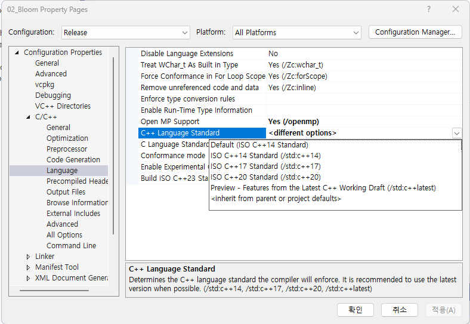
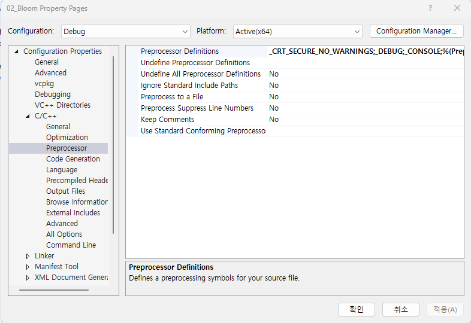
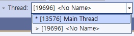
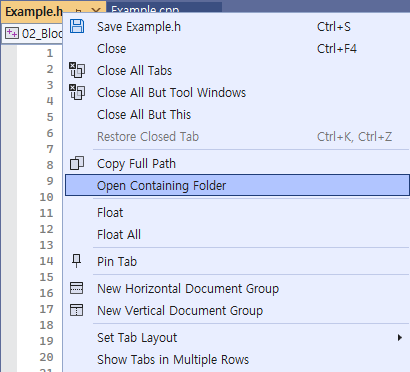
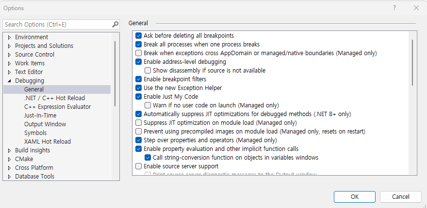
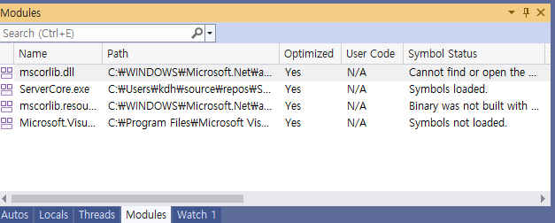
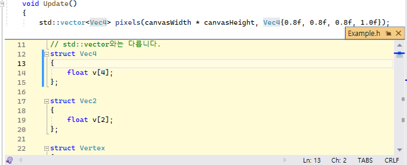

**Visual Studio 2022 TIP**
- [Properties](#properties)
  - [1. cpp compiler](#1-cpp-compiler)
  - [2. Preprocessor Definitions](#2-preprocessor-definitions)
- [Functions](#functions)
  - [1. Check Thread](#1-check-thread)
  - [2. Open Containing Folder](#2-open-containing-folder)
  - [3. 하나의 solution에 있는 projects를 동시에 실행](#3-하나의-solution에-있는-projects를-동시에-실행)
  - [4. Release 환경에서 BreakPoint 적용](#4-release-환경에서-breakpoint-적용)
- [Shortcut Keys](#shortcut-keys)
  - [alt + f12 ( peek definition )](#alt--f12--peek-definition-)

 

## Properties
### 1. cpp compiler

어떤 cpp compiler를 사용할지 결정한다.

 

### 2. Preprocessor Definitions

scanf, sprintf를 사용할 때 발생하는 warning을 없애줄 때 유용하다.

 
 

## Functions
### 1. Check Thread
 
Multi-Thread 환경에서 `현재 수행 중인 Thread를 알고 싶다면`, 프로그램을 일시정지 한 뒤에 Thread 목록을 살펴보면 된다. 

 

### 2. Open Containing Folder

선택한 파일이 위치한 Folder를 연다.

 

### 3. 하나의 solution에 있는 projects를 동시에 실행
Solution - Properties - Common Properties - Startup Project - check `Multiple startup projects` 

!

2개 이상의 projects를 동시에 실행해서 테스트 할 수 있다. 
Action 값을 Start로 세팅한 projects만 실행된다. 

 

### 4. Release 환경에서 BreakPoint 적용
[MS User code](https://learn.microsoft.com/en-us/visualstudio/debugger/just-my-code?view=vs-2022) 
 
Tool - Options에 위치한다 

Release 환경에서 실행할 때 break point는 무시한다. 
하지만 Enable Just My Code를 해제하면 break point에서 실행을 멈춘다. 

`최적화된 코드에서 생길 수 있는 Debugging 문제를 파악`할 수 있다 

 
Debugging 할 때, Modules window에서 Debugger가 user code로 취급하는 코드를 표시한다. 

 
 

## Shortcut Keys
### alt + f12 ( peek definition )

  - peek definition
  - 선택한 코드의 정의를 파일 이동 없이 보여준다.
